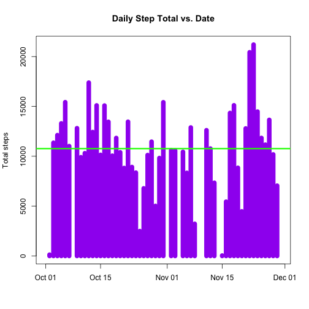

## Loading and preprocessing the data
First, let's check if the file exists in the directory, if not, it is downloaded.

```r
if(!file.exists("activity.csv")){
unzip("activity.zip")
}
```
The data are pretty clean, but the date should be formatted as a date and we'd like to see the number of steps taken per day

```r
activity<-read.csv("activity.csv")
activity$date<-as.Date(activity$date)

# Melt the data and then cast them by date, getting the sum of steps each day
activityMeltDate<-melt(activity,id.vars="date",measure="steps",na.rm=FALSE)
stepsPerDay<-dcast(activityMeltDate,date~variable,sum)
```
## What is mean total number of steps taken per day?
It helps to visualize what we have just done. We can use the above to plot the sum of the steps taken each day from the cleaned data.

```r
plot(stepsPerDay$date,stepsPerDay$steps,
typ="h",
lwd=10,
col="purple",
xlab="",
ylab="Total steps",
main="Daily Step Total vs. Date")
abline(h=mean(stepsPerDay$steps, na.rm=TRUE),col="green",lwd=3)
```

 

```r
dev.off()
```

```
## null device 
##           1
```

```r
mean(stepsPerDay$steps, na.rm=TRUE)
```

```
## [1] 10766.19
```

```r
median(stepsPerDay$steps, na.rm=TRUE)
```

```
## [1] 10765
```

The mean number of steps taken per day is 10766.19 and the median is 10765.

## What is the average daily activity pattern?
The interval where the max activity takes place is useful (that's the vertical blue line below). When is the subject most active?

```r
maxSteps<-max(stepsPerInt$steps)
filter(stepsPerInt,steps==maxSteps)
```

```
##   interval steps
## 1      835 10927
```


```r
# First, melt the activity data in terms of interval
activityMeltInt<-melt(activity,id.vars="interval",measure="steps",na.rm=TRUE)
stepsPerInt<-dcast(activityMeltInt,interval~variable,sum)

# Plot the steps per interval as a function of interval
plot(stepsPerInt$interval,stepsPerInt$steps,
typ="l",
lwd=3,
col="brown",
xlab="Interval ID",
ylab="Total steps",
main="Daily Step Total vs. Date")
abline(v=filter(stepsPerInt,steps==maxSteps)[1],col="blue",lwd=2)
abline(h=filter(stepsPerInt,steps==maxSteps)[2],col="light blue",lwd=2)
```

 

```r
dev.off()
```

```
## null device 
##           1
```

## Imputing missing values
We need to impute the missing values, but first, it helps to know how many there are

```r
sum(is.na(activity$steps))
```

```
## [1] 2304
```
That means that out of 17568 entries, 2304 are missing (13.1147541%).

To account for the large number of NA's, I will replace NA values with mean values for that time interval regardless of day of the week


```r
# make a new variable that will store the imputed data
actImpute<-activity

# find the average steps per interval, not counting NA's
actImputeMeltInt<-melt(actImpute,id.vars="interval",measure="steps",na.rm=TRUE)
avgSPI<-dcast(actImputeMeltInt,interval~variable,mean,na.rm=TRUE)

# replace the NA's with the average steps for the interval overall
for(i in 1:nrow(actImpute)){
  if(is.na(actImpute$steps[i])){
    intReplace<-which(avgSPI$interval==actImpute$interval[i]) #looks to see the row that the interval corresponds to in the avgSPI table
    actImpute$steps[i]=avgSPI[intReplace,"steps"] # replace the NA value with the average steps for that interval
  }
}

# melt the data, once again, for steps per day, with the imputed data
actImputeMelt<-melt(actImpute,id.vars="date",measure="steps",na.rm=FALSE)
spdImpute<-dcast(actImputeMelt,date ~ variable,sum)
```
Now we see that the number of NA's in the imputed data is 0.

```r
sum(is.na(spdImpute$steps))
```

```
## [1] 0
```

Let's look at the mean and median for the imputed data:

```r
mean(spdImpute$steps, na.rm=FALSE)
```

```
## [1] 10766.19
```

```r
median(spdImpute$steps, na.rm=FALSE)
```

```
## [1] 10766.19
```
There isn't much of a change.

## Are there differences in activity patterns between weekdays and weekends?
One might expect different activity trends between weekdays and weekends, so let's investigate:

```r
# first, separate the data based on weekday vs. weekend
for (i in 1:nrow(actImpute)) {
    if (weekdays(actImpute$date[i]) == "Saturday" | weekdays(actImpute$date[i]) == "Sunday") {
        actImpute$dayOfWeek[i] = "weekend"
    } else {
        actImpute$dayOfWeek[i] = "weekday"
    }
}

# store the weekend data subset and the weekday subset data in their own variables
wkendAct<-subset(actImpute,dayOfWeek=="weekend")
wkdayAct<-subset(actImpute,dayOfWeek=="weekday")

# melt/cast each by interval
actMeltWkday <- melt(wkdayAct, id.vars="interval", measure.vars="steps")
actMeltWkend <- melt(wkendAct, id.vars="interval", measure.vars="steps")
actCastWkday <- dcast(actMeltWkday, interval ~ variable, mean)
actCastWkend <- dcast(actMeltWkend, interval ~ variable, mean)

# finally, generate two line plots
par(mfrow=c(2,1))
plot(actCastWkday$interval,actCastWkday$steps,typ="l",lwd=2,xlab="Interval ID",ylab="Steps",col="red",main="Weekday Activity")
plot(actCastWkend$interval,actCastWkend$steps,typ="l",lwd=2,xlab="Interval ID",ylab="Steps",col="blue",main="Weekend Activity")
```

 

```r
dev.off()
```

```
## null device 
##           1
```

That's one way of looking at things, but it could help to see both sets of data plotted over one another.

```r
plot(actCastWkday$interval,actCastWkday$steps,typ="l",lwd=2,xlab="Interval ID",ylab="Steps",col="red")
lines(actCastWkend$interval,actCastWkend$steps,typ="l",lwd=2,col="blue")
legend("topright", legend = c("Weekday Activity","Weekend Activity"),bty="n", lwd=c(2,2), col=c("red","blue"))
```

 

```r
dev.off()
```

```
## null device 
##           1
```

Here, it's a bit easier to see that weekday activity starts a bit earlier than on the weekend, but there is more activity later in the day for weekends than for weekdays.

